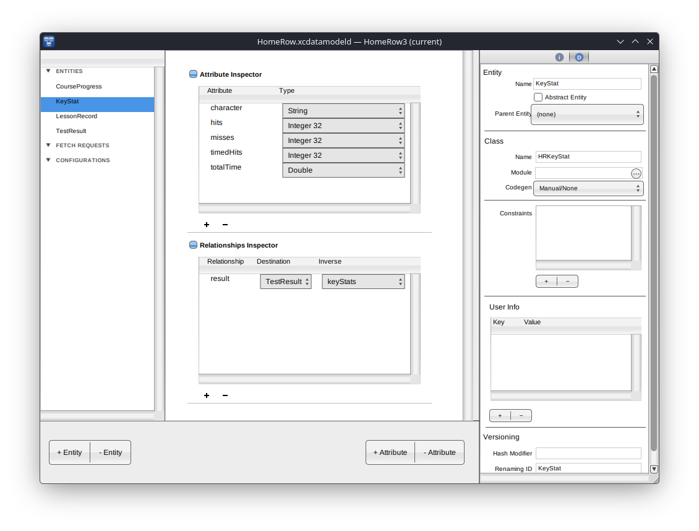

# ModelBuilder

Document-based AppKit editor for Xcode `.xcdatamodeld` packages — the
GNUstep counterpart of Xcode's Core Data model editor.



The document **is** an `NSManagedObjectModel`. Opening a package runs
the version XML through `CDModelCompiler` (momc's parser); saving runs
the live model back through `CDModelSerializer` (its inverse). The
editor, the compiler and the runtime therefore share one schema
implementation — there is no separate editor-side model, and
`compile(serialize(model))` is covered by the round-trip tests in
`Tests/MomcSerializerTests.m` on both GNUstep and macOS.

Lives at the **FreeCoreData repo root** (`ModelBuilder/`), next to
`Tools/momc` and `coredata-model.make`.

Built for GNUstep (libobjc2 / clang, ARC, GSXib5) and for macOS.

## Layout

The window layout lives in `MBDocumentWindow.xib`, modeled closely on
Xcode's Core Data editor and loaded by AppKit on macOS and by GSXib5
on GNUstep.  `MBWindowController` adds only behavior: outlet wiring,
target/action, runtime column identifiers, popup population.  Three
panes in a split view, like Xcode's editor:

| Pane | Contents |
|---|---|
| Left | Source list — ENTITIES, FETCH REQUESTS, CONFIGURATIONS (headed by the implicit, read-only **Default**) — with "+/− Entity" and "+/− Attribute" segmented controls in the bottom bar |
| Center | The selected item's editor: Attributes and Relationships tables in collapsible sections (JUInspectorView) for an entity, with Xcode's popup columns for Type, Destination and Inverse; "Fetch all" popup and predicate editor (with a T/S source toggle) for a fetch request; the entity membership checklist for a configuration, where selecting an entity shows it in the inspector |
| Right | DMTabBar (Identity / Data Model tabs) over the inspector — the Data Model page for the selection (entity, attribute, relationship or fetch request), with per-type attribute pages, validation, uniqueness constraints, `userInfo` tables and versioning fields |

The vendored `ThirdParty/` controls (DMTabBar, JUInspectorView — both
MIT) supply the Xcode-style inspector chrome.  The side panes keep their
width as the window resizes and the center takes the difference; the
inspector scrolls when the window is shorter than its sections.

The **Model** menu (in `MainMenu.xib`, routed through the responder
chain) adds entities, fetch requests, configurations, attributes and
relationships, and holds **Create NSManagedObject Subclass…**
(Xcode-identical sources from `CDCodeGenerator`), **Add Model Version**
(duplicates the edited version under the next free "Model N" name),
**Make Current Version** (moves the `.xccurrentversion` pointer), a
**Model Version** submenu for switching (filled in by `main.m`; the
edited version is checked, the current one marked), **Validate**
(serializes and recompiles through momc, reporting its errors and
warnings), **Compile to momd** and **Remove Entity**.  The window title
shows the edited version.

## What it edits

- Entity name, class, parent, abstract, uniqueness constraints,
  codegen (Manual/None, Class Definition, Category/Extension), version
  hash modifier, renaming identifier, `userInfo`
- Attribute name, type (including `UUID` and `URI`), optional /
  transient, per-type defaults (dates through date pickers), scalar
  type, validation (numeric min / max, string length and regular
  expression, date bounds), derivation expression
  (`uppercase:(title)`, `now()`, key paths — the Derived checkbox
  prompts for it), transformer name and custom class for
  Transformable, version hash modifier, renaming identifier, `userInfo`
- Relationship name, destination, inverse, to-one / to-many, ordered,
  delete rule, min / max count, optional / transient, version hash
  modifier, renaming identifier, `userInfo`
- Fetch request template name, entity, fetch limit, batch size, result
  type, the include / return flags, predicate
- Configuration name and entity membership (the implicit Default
  configuration lists every entity and is not editable)
- Model versions (add, switch, set current)

Structural changes with graph-wide consequences — deleting an entity,
changing an entity's parent — are applied to the XML and recompiled, so
momc renormalizes relationships, configurations and subentity wiring in
one step and invalid edits are rejected with the compiler's error.

Every edit can be undone and redone.  Undo is granular: each change
records its own inverse against the description object it changed (not
its name, so it survives renames), removals put back the same object at
the same index, and the graph-wide changes above swap the previous model
back.  One user action is one step, and undoing to the saved state
clears the document's edited mark.  Typing in a field has its own undo
until the field commits.

Uniqueness constraints and every other schema feature momc understands
survive open/save untouched even where the editor has no UI for them
yet: the document round-trips through the same serializer the tests
pin down.

## Compiling and decompiling

Validate runs momc in-process. From the command line, the sibling tool
compiles and — new — decompiles:

```
Tools/momc/obj/momc Model.xcdatamodeld Model.momd
Tools/momc/obj/momc --decompile Model.momd Model.xcdatamodeld
```

`--decompile` turns a compiled artifact back into editable source
(every version, `.xccurrentversion` reconstructed), which is how an
existing `.momd` is imported into the editor.

## GNUstep

```
. /usr/share/GNUstep/Makefiles/GNUstep.sh
cd ModelBuilder
make
openapp ./ModelBuilder.app
```

`MainMenu.xib` and `MBDocumentWindow.xib` are the app's two nibs;
both load through GSXib5.  A few GNUstep fixes the app depends on (table
column autoresizing and xib date pickers in libs-gui, bezeled nib text
fields in the Eau theme) are carried in `patches/gnustep/` until they
are upstream; the CI and release builds apply them.

Linux users get ModelBuilder as an AppImage from the tagged releases
(GNUstep stack and Eau theme inside), built by
`.github/workflows/release.yml` with the scripts in `Scripts/`.

## macOS

Open `ModelBuilder/ModelBuilder.xcodeproj` and run the **ModelBuilder**
scheme.  Tagged releases also publish a signed, notarized universal app. The app registers `.xcdatamodeld` / `.xcdatamodel` as document
packages and builds against Apple CoreData — the compiler and
serializer sources are portable and are cross-verified against Apple's
classes by the test suite.

## Why this exists

Xcode's model editor is the stock tool on a Mac. On GNUstep there is no
equivalent, and FreeCoreData example models are otherwise edited by
hand (issue #11). ModelBuilder is that editor: same XML Xcode writes,
same three-pane shape as the Xcode designer, with momc as the single
authority on what the XML means.
