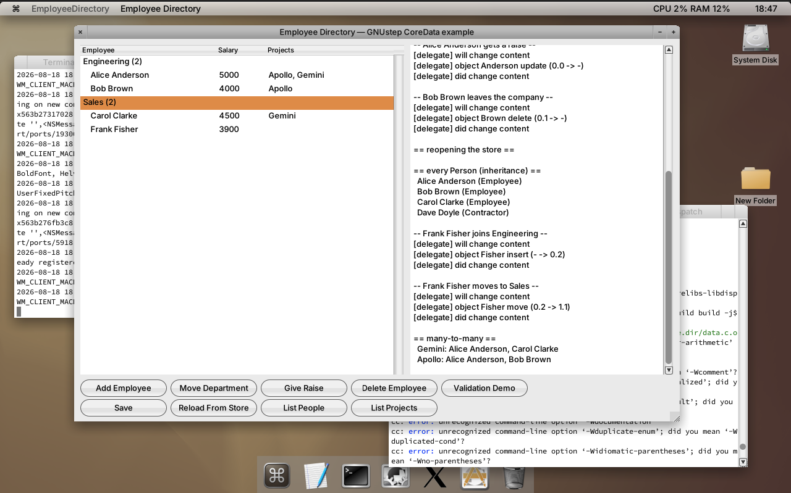
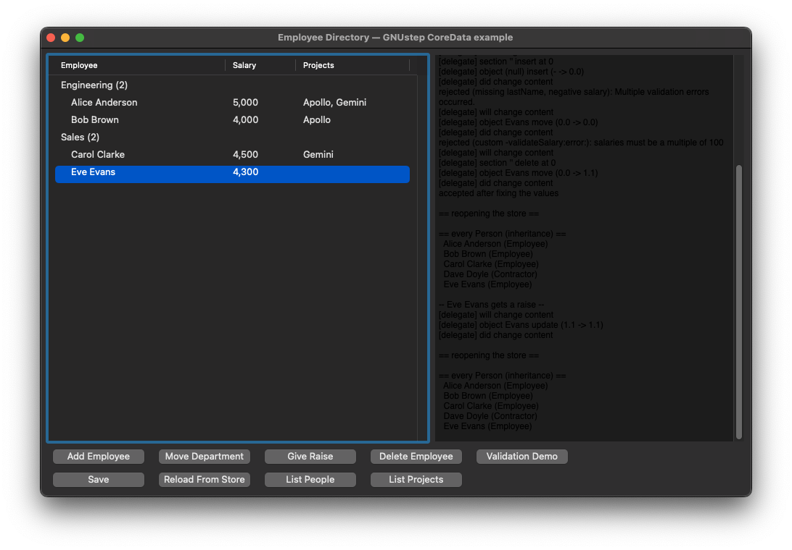

# GNUstep-compatible CoreData implementation

A port of the Cocotron CoreData runtime for GNUstep on Linux (and compatible with Apple's CoreData API on macOS).

## Attribution

This project ports sources from the [Cocotron](https://github.com/cjwl/cocotron) project (MIT license).
See [LICENSE](LICENSE) and [LICENSE-Cocotron.txt](LICENSE-Cocotron.txt) for full license text and copyright holders.

`NSFetchedResultsController` follows the change tracking approach of
[MRTFetchedResultsController](https://github.com/matteorattotti/MRTFetchedResultsController)
by Matteo Rattotti (MIT license), extended with the sectioning and index path based API of
Apple's `NSFetchedResultsController`.

## Structure

```
CoreData/                        - Framework source (headers + implementation)
Tests/                           - Test suite (runs on GNUstep and macOS/Xcode)
Examples/EmployeeDirectory/      - SQLite based example application
ModelBuilder/                    - Document-based .xcdatamodeld editor (AppKit)
Tools/momc/                      - Xcode model compiler (.xcdatamodeld → .momd)
coredata-model.make              - gnustep-make fragment for XCDATAMODELD_FILES
GNUmakefile                      - Build script for GNUstep (framework.make)
Tests/GNUmakefile                - Build script for the XCTest bundle
CoreDataTests.xcodeproj/         - Xcode project for macOS unit tests
```

## Building on GNUstep

Requires gnustep-make and GNUstep-base. The modern runtime (gnustep-2.0 / libobjc2) is recommended.
See [docs/GNUSTEP-SETUP.md](docs/GNUSTEP-SETUP.md) for step-by-step instructions on building the
full modern toolchain (libobjc2, gnustep-make, gnustep-base, tools-xctest) from source.

```sh
. /usr/share/GNUstep/Makefiles/GNUstep.sh   # source the GNUstep environment
make
sudo make install
```

## Running tests on GNUstep

Tests are built as an XCTest bundle and run with the `xctest` runner that ships with GNUstep.

```sh
cd Tests
make run-tests
```

Or, step by step:

```sh
cd Tests
make
. $(gnustep-config --variable=GNUSTEP_MAKEFILES)/GNUstep.sh
xctest CoreDataTests.bundle
```

## Running tests on macOS/Xcode

Open `CoreDataTests.xcodeproj`, select the **CoreDataTests** scheme, and run (`⌘U`).
The tests compile against Apple's built-in CoreData and XCTest frameworks — no custom shim needed.

## Example application




`Examples/EmployeeDirectory` is a graphical (AppKit) application showing entity
inheritance, transient properties, validation, to-one/to-many/many-to-many relationships
and `NSFetchedResultsController` on top of the SQLite store, with one button per usage
scenario.  It builds against this port on GNUstep and, via the bundled
`EmployeeDirectory.xcodeproj`, against Apple's CoreData/AppKit in Xcode; see
[Examples/EmployeeDirectory/README.md](Examples/EmployeeDirectory/README.md).

## Model editor

`ModelBuilder/` is a document-based AppKit editor for Xcode `.xcdatamodeld`
packages (current version only). It lives at the repo root next to `Tools/momc`
and `coredata-model.make`. Edit a model, then compile it:

```sh
make -C Tools/momc
Tools/momc/obj/momc Examples/EmployeeDirectory/EmployeeDirectory.xcdatamodeld /tmp/EmployeeDirectory.momd
```

See [ModelBuilder/README.md](ModelBuilder/README.md).

## Porting notes

- **Framework sources** are compiled with `-fno-objc-arc` (manual reference counting, matching the original Cocotron style). The modern GNUstep runtime (libobjc2) is fully compatible with MRC.
- **Test sources** (`Tests/CoreDataTests.m`) are compiled with ARC (`-fobjc-arc`) and use the real `<XCTest/XCTest.h>` on both GNUstep and macOS.
- Cocotron-specific macros (`NSUnimplementedMethod`, `NSInvalidAbstractInvocation`) are shimmed in `CoreData/CoreDataUtilities.h`.
- `isa` references replaced with `[self class]` / `NSStringFromClass([self class])` for portability.
- `NSXMLDocument` and related Foundation XML classes are used directly (available in GNUstep-base).
- `NSFetchedResultsController` index paths hold the section at position 0 and the row inside the
  section at position 1, matching Apple; build them with
  `+[NSIndexPath indexPathWithIndexes:length:]` since `indexPathForRow:inSection:` lives in
  UIKit/AppKit.  Section information caching (the `cacheName` argument) is not implemented.
- `-[NSRelationshipDescription isToMany]` matches Apple: a relationship is to-one exactly when
  `maxCount` is one (a `maxCount` of zero means unbounded, i.e. to-many); `minCount` only
  expresses whether the relationship is mandatory.
- `-[NSManagedObject valueForKey:]` dispatches to a custom accessor implemented by the
  subclass (e.g. a computed transient property) before falling back to the modeled storage,
  matching Apple's key-value coding behavior.
- When both AppKit and CoreData are imported on GNUstep, import AppKit first: GNUstep's AppKit
  duplicates the `NSAttributeType` constants in `NSPredicateEditorRowTemplate.h`, and the
  CoreData headers step aside when that header was already included.
